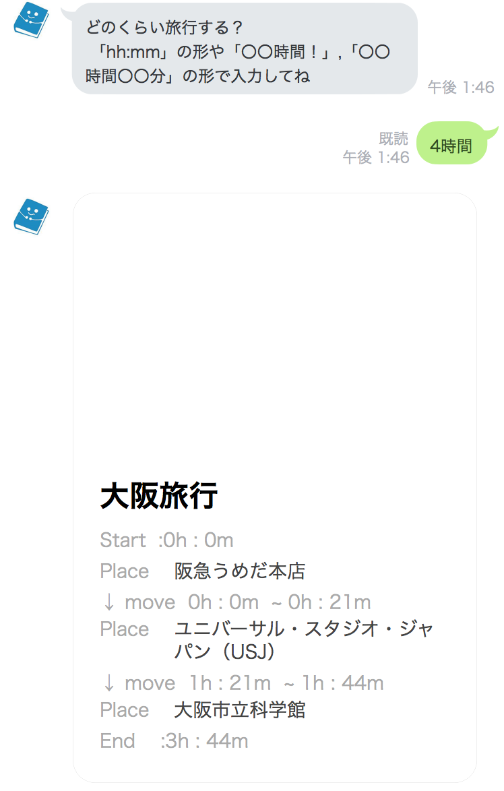

# 旅のおとも
===============  
行き先と時間を伝えると簡単に旅程を提案してくれるLINE BOT

## Description
旅のおともはLINE Messaging APIを利用したLINE BOTです.トークルームで行き先の県と滞在時間を伝えると対象の県からいくつか名所をピックアップし,滞在時間内でいい感じに周遊可能なプランを提示してくれます.現在はいくつかの候補からBotが自分で判断してプランを提案してくれますが,今後はユーザーが投稿した旅行プランも提案し,最終的には旅行プランに関する総合プラットフォームを目指しています.このBOTはLINE BOOTAWARDSに応募予定です.

## Main Functions
- 目的地と所要時間から旅行のプランを提案してくれる機能
- 自分のおすすめのスポットをBotに覚えさせる機能
- 列挙したスポットから最適な巡回の順番を提案してくれる機能(実装予定)
- 自分のおすすめの旅行プランをBotに覚えさせる機能(実装予定)

## Demo


YouTubeリンク or QRコード, URLを掲載予定です

## QR Code


## Requirement
- Python 3.6
- Plugins
  - line-bot-sdk
  - Flask
  - PuLP
  - requests
  - gunicorn
  - Flask-SQLAlchemy
  - lxml
  - beautifulsoup4
  - psycopg2
- [SDK of the LINE Messagin API for Python](https://github.com/line/line-bot-sdk-python)
- [Google Maps Platform](https://cloud.google.com/maps-platform/?hl=ja)


## Build & Setup
```
## register Google API

## create App and DB on heroku

## heroku deploy

## register LINE Developper


```

## Future work
- 市,町単位の検索
- 移動手段に徒歩を追加
- スポットの羅列で提案
- `旅行プランの登録`と登録したプランを提案
  - 「大阪旅行 by tomotan」 みたいなタイトルで
- ユーザーによる滞在時間の設定
- スポットと旅行プランの☆評価(1日一回とか)
- 現在地から対象の県までの計算
- リッチメニューの実装
  - おまかせ旅程
  - スポット登録
  - 旅記録登録(コメント)
  - 評価
  - 雑談


## Contribution
なにかあればIssuesまで

## Licence

[MIT](https://github.com/mikanbox/LineBot_Ryotei_Kun/blob/master/MIT-LICENSE.txt)

## Author

[mikanbox](https://github.com/mikanbox)
